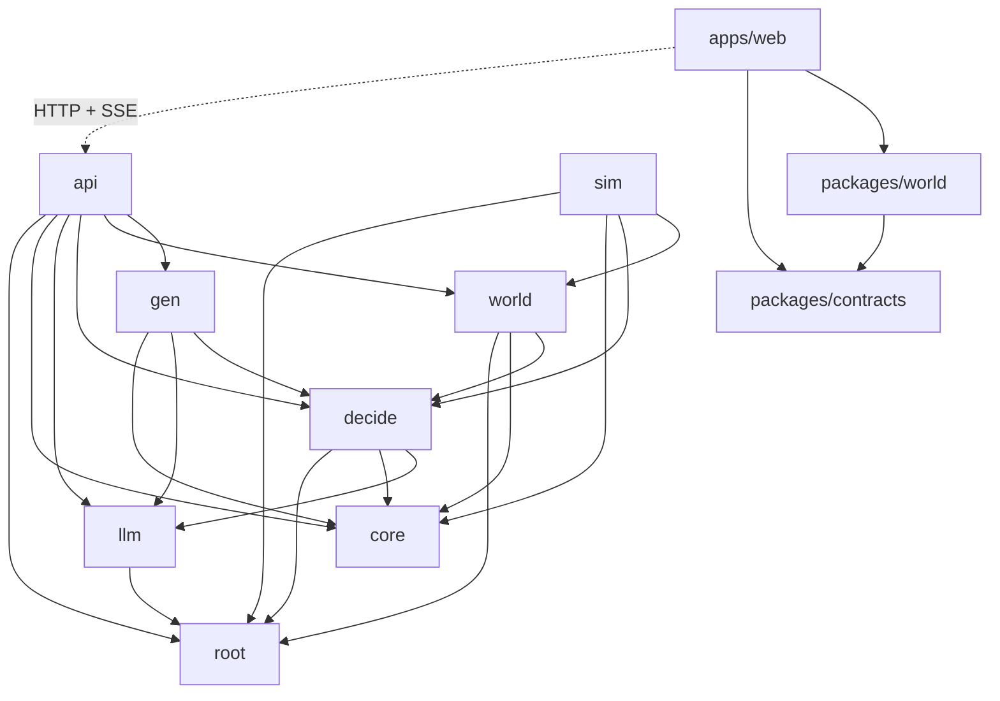
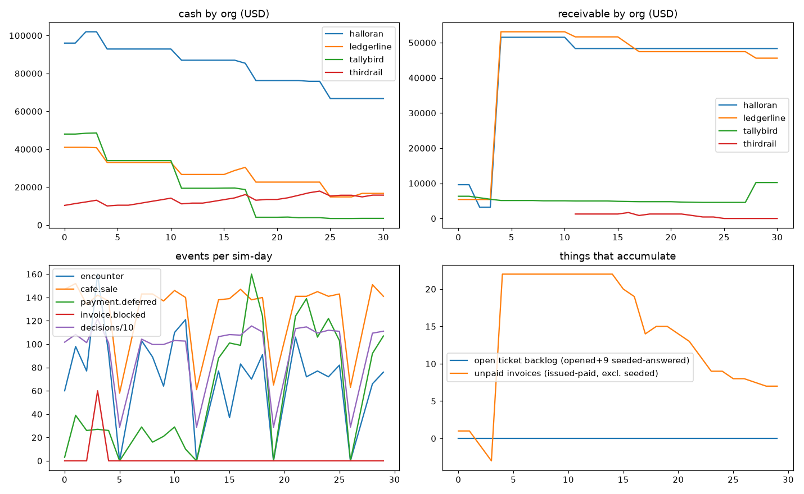
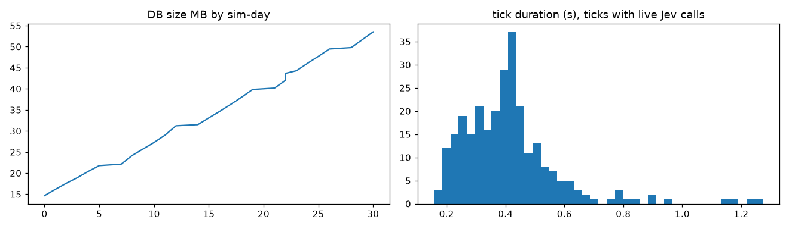
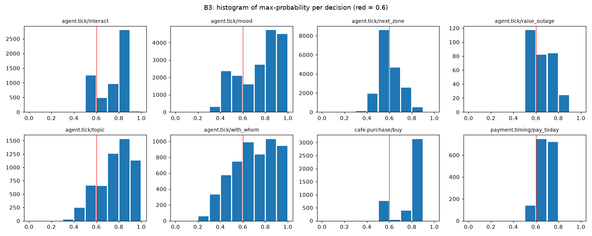
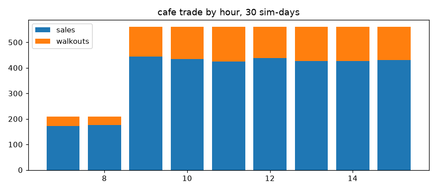

# jeve audit — 2026-09-21

Read-only. No source, test, ADR or cassette was changed; `git status` shows only `docs/audit/`. Throwaway scripts are in `ops/audit/` (gitignored). Evidence tags: **[V]** verified first-hand this session (command, query or file read), **[U]** inferred, not verified. Everything untagged in a table with a file path or a number is [V].

**Spend this session: $0.125 of the $1.00 budget** (F4). Ledger total is now $0.2067.

**Read these first:** B4 (sharing: separate draws — persona is *not* flattened at the cache layer, but it *is* flattened to three levels per trait before Jev ever sees it), B5 (the original probe never covered `agent.tick`, which is 75% of decisions; I ran it: `interact` holds strongly, `next_zone` weakly), and F2.

---

## A. Architecture and code quality

### A1. Module map

Python, `py/src/jeve` — 8,067 lines in 35 files [V: `ops/audit/modmap.py`, AST walk].

| package | files | lines | declared public surface | imports | imported by |
|---|---|---|---|---|---|
| `(root)` config, db, errors | 4 | 316 | — | — | api, decide, llm, sim, world |
| `core` | 4 | 184 | none (`__init__` empty) | — | api, decide, gen, sim, world |
| `llm` | 6 | 1,441 | `__all__`, 28 names | root | api, decide, gen |
| `decide` | 6 | 1,758 | none | root, core, llm | api, gen, sim, world |
| `world` | 7 | 2,894 | none | root, core, decide | api, sim |
| `sim` | 4 | 403 | `__all__`, 4 names | root, core, decide, world | — |
| `gen` | 2 | 222 | none | core, decide, llm | api |
| `api` | 2 | 849 | none | root, core, decide, gen, llm, world | — |
| `memory` | 0 | 0 | — (directory holds only a `decisions/` folder) | — | — |

Largest files: `world/engine.py` 1,081 · `decide/questions.py` 887 · `api/app.py` 849 (one file, 14 endpoints) · `llm/gateway.py` 600 · `world/flows.py` 589.

TypeScript: `packages/contracts` 2 files / 338 lines (zod only) · `packages/world` 4 files / 1,265 lines (imports `three`, `@jeve/contracts`, `zod`) · `apps/web/src` 11 files / 962 lines (imports `@jeve/contracts` ×12, `@jeve/world` ×2) · `apps/web/e2e` 2 files / 389 lines. Tests + scripts (Python): 5,793 lines.



1. **Package-level cycles: none** [V]. `tests/test_layering.py` enforces the forbidden edges.
2. **Module-level cycle inside `world`:** `engine.py:27` imports `flows` and `space`; both import `Engine` back under `TYPE_CHECKING` (`space.py:32`, `flows.py`), and `flows.py:514` imports `space` lazily inside a function. It works; it means `space`/`flows` are not modules so much as `Engine` methods living in other files — they call `engine.emit / decide / decide_many / post / schedule / next_seq / conn`, which are class-level aliases of private methods (`engine.py:198` `emit = _emit`, etc.).
3. **Reach-arounds:** `api/app.py:530` imports the private `_TRAIT_WORDS` from `decide.questions`. `api/app.py` also lazily imports `jeve.world.map`, `jeve.world.seed_world.ORGS`, `jeve.decide.recorder.insert_call`, `jeve.gen.dialogue` inside endpoint bodies. Only `llm` and `sim` declare a surface at all, so for the other six packages "public" is undefined and every cross-package import is a submodule import.
4. **Dead modules:** `world/events.py` — 147 lines of pydantic event payloads, imported by nothing, 0% coverage [V: grep + coverage]. Events are written as raw dicts (`engine.py` `_emit(payload: dict)`), so **event payloads have no schema on the Python side at all**. `Engine.run_until` (`engine.py:288`) has no callers. `fetchEconomics` (`apps/web/src/lib/api.ts:42`) has no callers. `lib/tone.ts` is a 2-line re-export.

### A2. The `Policy` seam

<details><summary>`Policy`, `DecisionContext`, `Decision` — py/src/jeve/decide/policy.py:23-64</summary>

```python
@dataclass(frozen=True, slots=True)
class DecisionContext:
    """Everything a policy may look at. Small on purpose: Jev's accuracy falls
    as irrelevant state grows, so a context that is cheap to render here is
    also the one that survives contact with the model."""

    person_id: str
    role: str
    decision_seq: int
    sim_time: int
    kind: str
    """The question set being asked, e.g. `ticket.triage`."""
    facts: dict[str, object] = field(default_factory=dict)
    traits: dict[str, object] = field(default_factory=dict)


@dataclass(frozen=True, slots=True)
class Decision:
    """What was chosen, and enough to explain it afterwards."""

    chosen: dict[str, object]
    source: Source
    distributions: dict[str, dict[str, float]] = field(default_factory=dict)
    draws: dict[str, float] = field(default_factory=dict)
    prng_path: str = ""
    model_call: str | None = None


@runtime_checkable
class Policy(Protocol):
    def decide(self, ctx: DecisionContext) -> Decision: ...

    def decide_many(self, contexts: Sequence[DecisionContext]) -> list[Decision]:
        """Decide several *independent* contexts at once.

        Independent means no context's facts depend on another's outcome. A
        model-backed policy issues them concurrently; the results must equal
        deciding each alone, in order.
        """
        ...
```
</details>

Call sites — 13, all via `Engine._decide` / `_decide_many` (`engine.py:148,155`) [V: grep]:

| # | site | kind | single / batch |
|---|---|---|---|
| 1 | `engine.py:466` | `file.ticket` | single, in a loop |
| 2 | `engine.py:538` | `ticket.triage` | single |
| 3 | `engine.py:596` | `ticket.answer` | single |
| 4 | `engine.py:817` | `payment.timing` (org payers) | single |
| 5 | `engine.py:917` | `payment.timing` (outside clients) | single |
| 6 | `engine.py:1029` | `cafe.purchase` | **batch** |
| 7 | `space.py:269` | `agent.tick` | **batch** |
| 8 | `flows.py:111` | `credit.decision` | **batch** |
| 9–11 | `flows.py:206, 341, 460` | `payroll.release`, `close.signoff`, `catering.order` | single |

Decisions made **outside** the seam (code RNG, `derive_rng`) [V]:

| # | where | what is decided | keyed by |
|---|---|---|---|
| 1 | `engine.py:347-351` | whether a module fails this tick | `("hazard", tick_seq)` |
| 2 | `engine.py:450-458` | which subscribers *notice* an outage (12%/tick of the first 40) | `("customers", tick_seq)` |
| 3 | `engine.py:691-703` | every month-end invoice **amount** | `("invoice", org, tick_seq)` |
| 4 | `engine.py:896-911` | which clients even consider paying (25%/tick of 8) | `("clientpay", tick_seq)` |
| 5 | `engine.py:990-1009` | who walks into the cafe | `("cafe", tick_seq)` |
| 6 | `space.py:105` | which spot a visitor stands on | `("spot", agent, tick_seq)` |
| 7 | `space.py` `_escalate` | what an escalation buys (÷4, floor 30 min) | constant |
| 8 | `space.py` `run` | commuting, going home | clock rule |

All of 1–5 are keyed by **`tick_seq`**, which CORE-0005 says not to do; B6 shows the consequence (an intervention changes invoice amounts by itself).

**Interchangeable?** Mechanically yes — `Engine` never branches on policy type; it only copies `decision.source` into rows and payloads [V: grep for `isinstance`/`JevPolicy` in `world/`: none]. Four qualifications:

1. `sim/daemon.py:217,226` does `isinstance(policy, JevPolicy)` to read `recorder.stats` and to `close()`. Lifecycle and spend are not in the protocol.
2. **Gates are implemented twice.** "Not due yet", "can't afford", "ticket already open" live in `questions.py` `_prepare_*` for Jev and again inside each `RulesPolicy._handler`. They can drift.
3. **The two policies do not mean the same thing by one question.** `payment.timing` under Jev is a day-level probability thinned to a per-tick hazard (`H` mode); under rules it is a raw per-tick probability (`policy.py` `_payment_timing`). N1 is therefore not a like-for-like null model for that flow.
4. `facts` and `traits` are `dict[str, object]` with string keys agreed by convention between `engine`/`space`/`flows`, `questions.py` and `policy.py`. A misspelt key is a silent default, in both policies.

### A3. Question sets

1. **Defined in code only** — `decide/questions.py`, one `QuestionSet(kind, prepare, interpret)` per kind, registered in a dict at the bottom. No data files.
2. **Not versioned.** There is no version field; the only "version" is the content hash of the rendered request.
3. **Not per-role.** Role appears once, as a noun in `agent.tick`'s `person` string. A partner and a paralegal get identical questions and options.
4. **Not composable.** Each set hand-builds its `state` dict and its `Ask`s. Shared pieces are helper functions (`trait_words`, `backlog_words`, `queue_words`, `lateness_words`, `time_of_day_words`, `_yes_no`). `agent.tick` is the only set that assembles asks conditionally.
5. **Duplication:** 10 sets in 887 lines; each repeats the same ~40-line shape (module-level `Ask`, `_prepare_x` building a dict, `_interpret_x` unpacking `got[...]`). Plus the gate duplication in A2.2.
6. **Where Jev's text is assembled:** `_prepare_*` (state) + the `Ask` constants (instructions, criteria) → `JevPolicy._request` (`jev_policy.py`) → `Gateway.decide_raw` builds the body (`gateway.py`).
7. **Under test?** Structurally, yes (`tests/test_questions.py`: no numbers in state, every choice has `other`, score levels are prose, same context → same request, gates). **Textually, almost not:** one test asserts the exact `who_is_here` dict; nothing snapshots a full rendered state, so a wording change is invisible to tests and shows up only as cassette misses.

<details><summary>`cafe.purchase` — py/src/jeve/decide/questions.py:404-450</summary>

```python
_BUY = Ask(
    "buy",
    "P",
    Noul(
        instructions="Does this customer stay and buy something?",
        criteria=_yes_no(
            "They wait their turn and buy a drink or something to eat.",
            "They give up and leave without buying anything.",
        ),
    ),
)


def _prepare_cafe(ctx: DecisionContext) -> Prepared:
    return Prepared(
        ctx.kind,
        asks=(_BUY,),
        state={
            "person": "someone who has just walked into a neighbourhood cafe",
            "temperament": trait_words("patience", ctx.traits.get("patience")),
            "line": queue_words(ctx.facts.get("queue_length")),
            "till": (
                "The card reader is broken; the cafe is taking cash only and "
                "service is slow."
                if ctx.facts.get("pos_down")
                else "The cafe is running normally and taking cards."
            ),
        },
    )


def _interpret_cafe(
    ctx: DecisionContext, got: dict[str, Resolved], draw: Draw
) -> Outcome:
    if not got["buy"].value:
        waiting = _number(ctx.facts.get("queue_length")) > 0
        return Outcome(
            {"buy": False, "reason": "queue" if waiting else "changed_mind"}, {}
        )
    # How much they spend is a till fact, not a judgement: same draw the rules
    # twin uses, so the two policies differ only in whether they buy.
    roll = draw()
    return Outcome(
        {"buy": True, "amount_cents": 350 + int(roll * 600)}, {"amount": roll}
    )
```
</details>

<details><summary>`agent.tick` — py/src/jeve/decide/questions.py:451-644</summary>

```python
# -- agent.tick: where next, and whether to stop and talk (WORLD-0003) --------

ORG_WORDS: dict[str, str] = {
    "tallybird": "the software company",
    "halloran": "the law firm",
    "ledgerline": "the accounting firm",
    "thirdrail": "the cafe",
}
_PLACE_WORDS: dict[str, str] = {
    "software_office": "the software company's office",
    "law_office": "the law firm's office",
    "accounting_office": "the accounting firm's office",
    "cafe": "the neighbourhood cafe",
    "plaza": "the plaza outside, by the fountain",
}
MOODS: tuple[str, ...] = (
    "Stressed and short-tempered.",
    "Flat; just getting through the day.",
    "Content and settled.",
    "Upbeat and energetic.",
)


def slot(index: int) -> str:
    """A neutral label for someone present. Names and ids are noise to Jev,
    and would stop two identical rooms sharing a call."""

    return f"person_{chr(ord('a') + index)}"


def describe(person: dict[str, object]) -> str:
    role = str(person.get("role", "employee")).replace("_", " ")
    return f"a {role} from {ORG_WORDS.get(str(person.get('org')), 'another firm')}"


def _present(ctx: DecisionContext) -> list[dict[str, object]]:
    present = ctx.facts.get("present")
    return (
        [p for p in present if isinstance(p, dict)] if isinstance(present, list) else []
    )


def _next_zone(org: str) -> Ask:
    criteria: dict[str, str] = {
        "stay": "Stay where they are for the next fifteen minutes.",
        "own_workplace": "Go back to their own workplace and get on with work.",
        "cafe": "Walk over to the cafe for a coffee or something to eat.",
        "plaza": "Step out into the plaza for some air.",
    }
    if org != "tallybird":
        criteria["software_office"] = (
            "Walk over to the software company's office to speak to them in person."
        )
    criteria["other"] = "Something else."
    return Ask(
        "next_zone",
        "P",
        Choice(
            instructions="Where does this person go in the next fifteen minutes?",
            criteria=dict(criteria),
        ),
    )


_INTERACT = Ask(
    "interact",
    "P",
    Noul(
        instructions=(
            "In the next fifteen minutes, does this person stop and have a "
            "conversation with one of the people listed as being here?"
        ),
        criteria=_yes_no(
            "They stop and talk with someone who is here.",
            "They keep to themselves.",
        ),
    ),
)
_MOOD = Ask(
    "mood",
    "J",
    Score(instructions="What is this person's mood right now?", criteria=list(MOODS)),
)
_RAISE = Ask(
    "raise_outage",
    "P",
    Noul(
        instructions=(
            "Does this person bring up the broken software with the software "
            "company's employee who is here, and press them to get it fixed?"
        ),
        criteria=_yes_no(
            "They raise the outage and push for it to be fixed.",
            "They do not bring it up.",
        ),
    ),
)


def _prepare_agent_tick(ctx: DecisionContext) -> Prepared:
    org = str(ctx.facts.get("org", ""))
    here = str(ctx.facts.get("here", ""))
    at_own = here == ctx.facts.get("own_zone")
    present = _present(ctx)
    outage = ctx.facts.get("outage")

    state: dict[str, object] = {
        "person": f"a {ctx.role.replace('_', ' ')} at {ORG_WORDS.get(org, 'a firm')}",
        "temperament": trait_words("sociability", ctx.traits.get("sociability")),
        "work_habit": trait_words("diligence", ctx.traits.get("diligence")),
        "time": time_of_day_words(ctx.sim_time),
        "where": (
            "at their own workplace" if at_own else f"in {_PLACE_WORDS.get(here, here)}"
        ),
        "on_their_mind": (
            f"The {outage} software has been down and it is disrupting the day."
            if outage
            else "Nothing unusual; an ordinary working day."
        ),
    }
    asks: list[Ask] = [_next_zone(org), _MOOD]
    if present:
        state["who_is_here"] = {slot(i): describe(p) for i, p in enumerate(present)}
        topics: dict[str, str] = {
            "work": "Their own work and clients.",
            "money": "Bills and invoices; who owes whom.",
            "small_talk": "The weather, the weekend, nothing in particular.",
        }
        if outage:
            topics = {"the_outage": "The software outage.", **topics}
        topics["other"] = "Something else."
        people: dict[str, str] = {
            slot(i): describe(p).capitalize() + "." for i, p in enumerate(present)
        }
        people["other"] = "Nobody in particular."
        asks += [
            _INTERACT,
            Ask(
                "with_whom",
                "P",
                Choice(
                    instructions=(
                        "If this person talks to someone here, who is it most "
                        "likely to be?"
                    ),
                    criteria=dict(people),
                ),
            ),
            Ask(
                "topic",
                "P",
                Choice(
                    instructions="If they talk, what is it most likely about?",
                    criteria=dict(topics),
                ),
            ),
        ]
        if ctx.facts.get("can_raise"):
            asks.append(_RAISE)
    else:
        state["who_is_here"] = "Nobody they would stop to talk to."
    return Prepared(ctx.kind, asks=tuple(asks), state=state)


def _interpret_agent_tick(
    ctx: DecisionContext, got: dict[str, Resolved], draw: Draw
) -> Outcome:
    here = str(ctx.facts.get("here", ""))
    own = str(ctx.facts.get("own_zone", here))
    choice = str(got["next_zone"].value)
    next_zone = {"stay": here, "other": here, "own_workplace": own}.get(choice, choice)

    present = _present(ctx)
    with_id: str | None = None
    if "interact" in got and got["interact"].value:
        picked = str(got["with_whom"].value)
        for index, person in enumerate(present):
            if slot(index) == picked:
                with_id = str(person["id"])
    return Outcome(
        {
            "next_zone": next_zone,
            "interact": with_id is not None,
            "with": with_id,
            "topic": str(got["topic"].value) if with_id and "topic" in got else None,
            "mood": int(str(got["mood"].value)),
            "raise_outage": bool(
                with_id and "raise_outage" in got and got["raise_outage"].value
            ),
        },
        {},
    )
```
</details>

### A4. Extension cost

Estimates are mine, for someone who knows the codebase; "files" are ones that **must** change [V: grep counts where given].

| # | change | files that must change | hours | why it costs that |
|---|---|---|---|---|
| a | 11th flow | `world/flows.py` (logic), `world/engine.py` (`_run_due` is a 9-branch `if kind ==` string dispatch), `world/seed_world.py` (schedule), `decide/questions.py` (set), `decide/policy.py` (twin), `tests/test_questions.py` (`ASKING` dict — a test fails until you add it), `tests/test_flows.py`, then re-record cassette | **3–4** | done four times last night at ~40 min each plus debugging; no registry, five edit sites |
| b | 5th org | org ids are string literals: `tallybird` 44× in 7 py files, `thirdrail` 27×/7, `ledgerline` 22×/5, `halloran` 20×/5, plus 25 in TS. Must touch `seed_world.py` (ORGS, STAFF, opening cash, subs), `map.py` (`ORG_ZONE`, `BUILDINGS`, `Zone`), migration (zone CHECK), `questions.py` (`ORG_WORDS`, `_PLACE_WORDS`, `_next_zone` options), `gen/dialogue.py` (`PLACE_WORDS`), `engine.py` (`_month_end` hard-codes `("halloran","ledgerline")`), `flows.py` (`CLOSE_FEE_CENTS`, catering lists), `contracts/world.ts` (`ZONES`, `ORG_PALETTE`), `contracts/index.ts` (`ORG_COLORS`), `world/voxels.ts` (`ZONE_ORG`), two e2e specs | **10–14** | an "org" is not data; it is ~140 literals. The map has four fixed corners |
| c | new zone | `map.py` (enum, layout, spots), migration (`positions.zone` CHECK), `questions.py` ×2, `dialogue.py`, `contracts/world.ts`, `voxels.ts`; invalidates every `agent.tick` cassette row | **4–6** | six hard-coded sites; enum duplicated in SQL, Python, zod |
| d | new trait | `seed_world.py` `_traits` (append last or every trait re-rolls), `questions.py` (`_TRAIT_RANGE`, `_TRAIT_WORDS`), `policy.py` twin; API/panel pick it up automatically | **1–2** | cheapest change in the system. But see B6: a trait only matters if a set *renders* it — `vocality` is never shown to Jev in `agent.tick` |
| e | new primitive in an existing flow | `questions.py` (Ask + interpret), engine/flow consumer, twin, test; every call of that kind re-records | **1–2** | clean |
| f | native TypeSafe endpoint | `llm/gateway.py` (`decisions_url`, auth header, `_usage_from` — native cost field [U]), `llm/catalog.py` (decision slugs resolved from OpenRouter's catalogue), `config.py` (key), LLM-0001/0005 | **4–6** | the seam is right (`Gateway.decide_raw`); pricing, catalogue and `/key` reconciliation are OpenRouter-shaped |
| g | SQLite for local dev | 46 Postgres-specific SQL sites in `src` (jsonb `->>`, `= ANY(%s)`, `RETURNING`, `FILTER`, `bigint[]` causes, recursive CTE over arrays), deferred constraint trigger, advisory lock, `pg_depend` sequence resync, `TRUNCATE … RESTART IDENTITY` | **25–40; don't** | CORE-0007 chose the database as the invariant-keeper. This is a rewrite of the persistence layer |
| h | two sims at once | works **today** as two databases (`JEVE_DATABASE_URL`) — I ran four side by side this session. In one DB: `sim_meta` is a singleton (`only_row` PK), no `run_id` on any table, one advisory-lock key, sequence resync assumes one writer | **0** (separate DBs) / **20+** (one DB) | the API reads one DSN per process, so two sims also means two APIs |

### A5. Type boundaries

| # | fact | evidence |
|---|---|---|
| 1 | The API has **no response models**: 14 endpoints, 0 `response_model`, 0 pydantic classes; every handler returns a hand-built `dict` | `grep -c response_model api/app.py` → 0 |
| 2 | TS side: 20 zod schemas, hand-written in `packages/contracts/src/{index,world}.ts`. **Nothing is generated**; Python and TS shapes are duplicated by hand | file read |
| 3 | Drift is caught only at **runtime in the browser** (`api.ts` `get()` → `safeParse`), i.e. only for shapes a Playwright spec happens to load: `WorldState`, `EventPage`, `CausalChain`, `PersonDecisions`, `TownMap`, `AgentsFrame`, `AgentDetail`, `OrgDetail` | spec read |
| 4 | **Not caught by anything:** `Economics` (no caller in the web app), `EncounterDialogue` (no spec clicks "imagine"), and **every event `payload`** — zod types it `z.record(z.unknown())`, and `packages/world/src/index.ts` reads `payload.path`, `payload.a`, `payload.topic` by cast | `index.ts` `toMove`, `onEvent` |
| 5 | Python `world/events.py` (the payload schema) is dead code; payloads are untyped dicts on both sides | A1.4 |
| 6 | Zone enum exists in three places by hand: SQL CHECK (`0003_space.sql`), `map.Zone`, zod `ZONES` | grep |
| 7 | **Money.** Stored as `bigint` cents, enforced by the DB. The session-1 `Decimal`→string bug is **patched per call site, not prevented**: four hand `int(row["cents"])` coercions (`app.py:95,103,135,656`) next to nine `sum(` queries. The SSE stream serialises with `json.dumps(row, default=str)` (`app.py:835`), which would turn any `Decimal` into a string silently | grep |
| 8 | One structural guard exists: zod `z.number().int()` on cents fields fails loudly in the browser if a string arrives — for the endpoints in row 3 only | contracts |

### A6. Failure modes

Retry policy: `gateway.py` `RETRYABLE_STATUSES = {429,500,502,503,504}`, 4 attempts, jittered exponential backoff capped at 8 s, honours `Retry-After`; concurrency semaphore 8. **No circuit breaker. No tick-level retry.** `sim/daemon.py` `_loop` catches exactly two exceptions: `BudgetExceededError` (→ status `halted`, exit 4) and `ReplayMissError` (→ `halted`, exit 5).

| # | failure | what happens | tested? | symptom in the UI |
|---|---|---|---|---|
| 1 | Jev timeout mid-tick | httpx 60 s timeout → retried ×4 (each attempt books $0.0005 as estimated spend) → `TransportError` → tick rolls back → **daemon exits with a traceback; `sim_meta.status` stays `running`** | retry: yes (`test_gateway`). Daemon behaviour: **no** | strip says `running` for ever; hero drifts to "quiet — replaying" after 40 s. Nothing says the daemon is dead |
| 2 | **HTTP 520 (happened, soak day 21)** | not in the retryable set → no retry → same crash as #1. 40 s latency, $0.0005 phantom spend booked | **no** | as #1. Evidence: `ops/audit/soak.crash-520.log`, ledger entry `outcome: http-520` |
| 3 | malformed Jev response | stored raw **first**, then `parse_decision` raises `ResponseShapeError` → crash. On restart the bad row is a cache *hit*, so it **crashes again on the same tick, for ever** — nothing evicts or refetches it | the raw-before-parse half: yes. The wedge: **no** | as #1, permanently |
| 4 | 429 | retried ×4, reservation released, no spend booked | yes | none if it recovers; else #1 |
| 5 | dialogue model fails | falls through the preference list; response carries `skipped` / `reason` | no-key and cached paths: yes. Fall-through: **no** (observed live: DeepSeek failed 8 of 12 tries — `unusable reply` ×4, `ResponseShapeError` ×4 — GLM answered) | panel prints the reason. Good |
| 6 | DB connection drops mid-tick | `OperationalError` propagates; `tick()`'s handler skips resync when `conn.closed`; daemon exits. No reconnect. Restart recovers (that is what `test_resume` proves) | indirectly, via kill -9 | as #1 |
| 7 | killed between reserve and settle | the reservation stands as spend for ever (deliberate, LLM-0004). No reaper: each one is a permanent $0.0005 | yes (`test_unsettled_reservation_still_counts`) | none |
| 8 | daemon not running at all | API serves the last committed world | — | **identical to #1** — the UI cannot distinguish paused, halted, crashed and never-started (screenshots `13-state-*`) |

CORE-0004 ("a dead model means a paused world", status `waiting_on_model`) is **not implemented**: the status exists in the CHECK constraint and is never written [V: grep]. A dead model means a dead daemon.

### A7. Concurrency and tick timing

1. The daemon is one process, one main thread for all DB work, plus one background thread running an asyncio loop that owns the `Gateway` (`jev_policy.py` `_Bridge`).
2. Within a tick: `agent.tick` (≤24), `cafe.purchase` (≤6) and `credit.decision` are **batched and concurrent** (≤8 in flight, single-flight per hash). The other seven kinds are **serial**, one blocking round-trip each, inside loops.
3. Measured over the 30-day soak, flat out, live Jev, 1,024 ticks [V: `ops/audit/soak/ticks.jsonl`]:

| ticks | n | p50 | p95 | p99 | max | mean live calls |
|---|---|---|---|---|---|---|
| all | 1,024 | 0.02 s | 0.50 s | 0.78 s | 1.27 s | 2.4 |
| with ≥1 live Jev call | 276 | 0.40 s | 0.70 s | 1.19 s | 1.27 s | 8.8 |
| fully cached | 748 | 0.02 s | 0.03 s | 0.04 s | 0.06 s | 0 |

4. Against the governor's budget of **15 s per tick**, the worst tick used 8%. The daemon keeps up with >10× headroom; the binding constraint on speed is the pacing, not the model. (One caveat: the single 520 took **40 s** before failing — longer than a tick.)
5. If it *did* fall behind: `daemon.py` sleeps `seconds_per_tick − elapsed`, floored at 0 by `_sleep`. It neither skips nor catches up; sim time simply runs slow. Nothing records or reports lag.

### A8. Cassette and replay

Key = `blake2b(canonical_json({"model": requested slug, "state": …, "questions": …}))`, where canonical JSON **sorts keys** (`core/hashing.py`, `recorder.py:61`).

Proof, offline against all 1,787 golden rows, no tree change (`ops/audit/cachekey.py`) [V]:

| # | targeted change | rows that still hit | requests whose wire body changed | verdict |
|---|---|---|---|---|
| 0 | none (method check) | 1,787 / 1,787 | 0 | recomputed hash == stored hash for every row |
| 1 | reword one verb in `instructions` | 48 / 1,787 | 1,739 | **correctly invalidated** (the 48 contain neither word) |
| 2 | **reverse the order of every choice's options** | **1,787 / 1,787** | **1,741** | **STALE REPLAY.** The wire body changes — Jev sees options in a different order — and every call still hits the cache |
| 3 | model slug → `jev-1.14` | 0 / 1,787 | 0 | correctly invalidated |
| 4 | trait bucketing thresholds | changes the rendered words → different state → miss or a hit on the *other* bucket's row | — | correct by construction [U: reasoned, not run] |

Two more holes:

5. The key uses the **undated** slug `typesafe/jev-1.13`; all 1,787 rows were served by `jev-1.13-20260917`. When TypeSafe rolls the weights behind the slug, replay keeps serving the old model's answers and nothing notices.
6. **The golden cassette is never pruned:** 1,787 rows committed, 1,090 used by the current 5-day run. 697 rows (39%, ~2.4 MB) are leftovers from earlier versions of the world.

**Byte-reproducible?** Yes. Two replay runs of 5 sim-days, dumped (`events`, `decisions`, `ledger_entries`, `positions`; 9,081 lines, 3,071,558 bytes each): `diff | wc -l` → **0**; SHA-256 identical (`89d32549…`) [V: `ops/audit/repro{1,2}.dump`]. And `tests/test_resume.py` holds it across three SIGKILLs.

### A9. Tests

211 Python test cases from 177 functions (5 parametrized) + 25 stdlib tests for the decisions generator + 12 browser specs.

| file | n (funcs) | class | what it actually asserts |
|---|---|---|---|
| `test_ledger_and_budget.py` | 20 | unit | reserve/settle arithmetic, the $12/$16/$20 ladder, 16 concurrent reservations cannot pass the ceiling, torn lines, incremental read (by bytes, not time) |
| `test_gateway.py` | 18 | unit (httpx MockTransport) | URL shape, retry/429/5xx accounting, run cap, raw-before-parse, per-path slug resolution |
| `test_catalog.py` | 7 | unit | slug resolution, near-matches |
| `test_questions.py` | 12 (+params) | unit | the lint in A3.7, gates, tertiles, hazard arithmetic |
| `test_sampling.py` | 9 | unit | J = argmax without a draw; P sampled; declared-order independence; normalisation |
| `test_layering.py` | 4 | unit (AST) | forbidden imports, incl. lazy ones |
| `test_db.py` | 11 | integration (Postgres) | migrations idempotent; DB refuses an unbalanced ledger txn |
| `test_world.py` | 24 | integration | rules world: invariants, Sargent extreme/degenerate, determinism, atomic tick, dead-time skipping |
| `test_space.py` | 12 | 4 unit + 8 integration | map reachability; **encounters-off control arm**; cascade reaches an invoice |
| `test_flows.py` | 10 | integration | four flows' consequences; books balance; second control arm (the close) |
| `test_jev_policy.py` | 12 | integration, **real recorded Jev responses** | replay determinism, no gateway in replay, strict miss, repeat-visitor sequencing, economics endpoint |
| `test_daemon.py` | 9 | integration | lock, horizon, restart, sequence resync, governor, tick visible to a 2nd session |
| `test_resume.py` | 2 | e2e (subprocess + SIGKILL) | byte-identical after three kills; `seq` dense |
| `test_api.py` | 21 | integration (TestClient) | endpoint shapes, SSE resume, world endpoints |
| `test_dialogue.py` | 6 (+params) | integration, no model | typed record always returned; cached prose needs no gateway |
| `a-world.spec.ts` | 7 | browser e2e | WebGL present; hero moves <10 s; `seq` rises; click person → distribution sums to 1; click building; pan ≠ select; off-screen ⇒ not drawn |
| `dashboard.spec.ts` | 5 | browser e2e | clock/orgs render; no negative receivable; cascade click; person decisions; org filter |

Coverage (pytest-cov, this session, 211 passed): **89% overall** [V: `ops/audit/coverage.txt`].

| package | stmts | miss | cover | the gap |
|---|---|---|---|---|
| core | 93 | 4 | 96% | |
| llm | 640 | 34 | 95% | |
| decide | 667 | 76 | 89% | **`jev_policy.py` 67%** — the entire live path (`_Bridge`, `_fill`, partial-failure handling) has never run under a test |
| world | 956 | 114 | 88% | `events.py` 0% (dead) — without it 97% |
| sim | 233 | 46 | 80% | `daemon.py` 78%: every error path |
| gen | 69 | 1 | 99% | |
| api | 267 | 44 | 84% | the generate branch of `/encounters/{seq}/dialogue` |
| TypeScript | — | — | **0 unit tests** | `WorldModel` was designed GL-free to be testable and has no test of its own; it is exercised only through Playwright |

**Most likely to break with no test:**

1. The live Jev path — bridge thread, `gather` with partial failures, store-then-raise (`jev_policy.py` `_fill`). Only ever run by hand.
2. Daemon on a transport error (A6.1–3): crash, stale `running`, and the malformed-row crash loop.
3. `WorldModel` interpolation/replay/picking arithmetic — no unit tests.
4. Cache-key semantics (A8 row 2) — no test pins what the key does and does not cover.
5. Long-horizon behaviour — no test runs past 8 sim-days; every B1 finding below lives there.

**Flaky / retried / reloaded:** one. `a-world.spec.ts` `ready()` reloads the page once if the world has not mounted in 25 s and annotates the test `reloaded` (WEB-0003). `playwright.config.ts` has `retries: 0`. No `xfail`, `skip` (other than "no database" / "no cassette"), or `flaky` markers [V: grep].

### A10. Debt inventory

Complete grep for `TODO|HACK|FIXME|XXX|type: ignore|# noqa|eslint-disable|@ts-expect-error|@ts-ignore|as any|: any|as unknown as` over `py/`, `scripts/`, `apps/web/{src,e2e}`, `packages/` [V]. **There are no TODO/HACK/FIXME comments at all.**

| rank | file:line | marker | why it is there |
|---|---|---|---|
| 1 | `py/src/jeve/sim/runner.py:48` | `type: ignore[return-value]` | env strings returned as `Literal` types after a runtime check mypy cannot see. Should be a cast or a parser |
| 2 | `py/src/jeve/decide/policy.py:298` | `type: ignore[attr-defined]` | `rng: object` so the module need not import banned `random`; the honest fix is a `Protocol` with `.random()` |
| 3 | `py/src/jeve/world/seed_world.py:86` | same | same |
| 4 | `apps/web/src/components/WorldExplorer.tsx:106` | `eslint-disable react-hooks/exhaustive-deps` | `parse` omitted from deps on purpose; note there is **no ESLint config in the repo**, so the comment disables nothing |
| 5 | `apps/web/e2e/a-world.spec.ts:32,166,210,234` | `window as unknown as {…}` ×4 | `window.__jeveWorld` is typed in `packages/world` via `declare global`, which the spec does not import |
| 6 | `py/tests/test_world.py:386,389` | `type: ignore` ×2 | monkeypatching `engine._post`. **Latent:** `flows.py` calls the class-level alias `engine.post`, which an instance-level patch of `_post` does not reach |
| 7 | `py/tests/test_sampling.py:31,35` | `type: ignore[arg-type]` ×2 | `mode: str` passed where a `Literal` is wanted |
| 8 | `scripts/test_gen_decisions.py:15` | `noqa: F401` | unused import kept |

Dead code and leftovers, ranked:

| rank | what | evidence |
|---|---|---|
| 1 | `py/src/jeve/world/events.py` (147 lines) — a payload schema nothing uses | 0 importers, 0% coverage |
| 2 | 697 unused rows in `py/fixtures/cassettes/golden.jsonl` (6.3 MB file) | A8.6 |
| 3 | `py/src/jeve/memory/` — an empty package holding one ADR | `ls` |
| 4 | `sim_meta.engine_sha`, `sim_meta.speed`, `persons.beliefs`, `persons.status`, `tickets.closed_sim`, `tickets.incident_id`, status `waiting_on_model` — columns/values nothing writes | grep |
| 5 | `Engine.run_until`, `fetchEconomics`, `lib/tone.ts` | grep |
| 6 | `apps/web` `PersonPanel` on `/` duplicates the newer `AgentPanel` on `/world` with a different design | D9 |
| 7 | `ops/night.json`, `ops/gates.json` (session 1 state), `ops/economics.replay.md`; `.claude/launch.json` | `ls ops` |
| 8 | `BLOCKED.md` — one entry, resolved | file |
| 9 | Root `package.json` lacks `"type": "module"`; Node warns on every TS script run | stderr of every `node` call this session |

### A11. ADR audit

26 records. Verdicts are against the code as it stands [V unless marked].

| ID | verdict | evidence |
|---|---|---|
| **DECIDE-0003** | **true, with one hole it does not admit** | words/J-P-H/gates/stored-row all as described. It claims replay safety from declared-order *sampling*; the *request* is not order-safe (A8 row 2). It also says nothing about the undated slug |
| **WORLD-0003** | **true; silently contradicts two older records** | one Jev call per person per tick is exactly what it says — and exactly what DECIDE-0001 ("an agent is evaluated only at a decision point") and CORE-0002 ("the unit of cost is the decision point, not the tick") forbid. Neither was superseded. Also: the persona trait built for complaining (`vocality`) is never rendered into `agent.tick`, so `raise_outage` cannot depend on it (`questions.py:551-560`) |
| **SIM-0001** | **true; incomplete** | lock, horizon, governor-as-pause, 10× nights all as written. Silent on transport errors, which kill the daemon and leave `status='running'` (A6) |
| LLM-0005 | true | `gateway.py` `start()`; `ops/providers.md` |
| WORLD-0002 | true | `engine.py` `tick()`; `test_resume.py` |
| WORLD-0004 | true | `test_flows.py`. Its own caveat (wages never return as spending) is visible in B1: Tallybird's cash runs out |
| WEB-0002 | true | `packages/world` |
| WEB-0003 | true; hypothesis still unproven | D8 |
| GEN-0001 | true | layering test; prompt omits traits (B10) |
| WORLD-0001 | true with caveats | A2.1–3 |
| API-0001 | true | `/events?latest=true` bends "cursor only" but returns ascending `seq` |
| LLM-0004 | true | ladder + ledger tests |
| LLM-0001, LLM-0003 | true / moot | JevPolicy sends no provider prefs at all, so 0003 is vacuously honoured |
| CORE-0001 | true | generator + CI job |
| CORE-0003 | true | `core/clock.py` |
| CORE-0007 | true **since last night** | was false until WORLD-0002 |
| **CORE-0002** | **partly implemented** | a ceiling that pauses, not a clock speed derived from budget; "unit of cost is the decision point" contradicted by per-tick `agent.tick` |
| **CORE-0004** | **never implemented** | `waiting_on_model` is never written; a dead model kills the daemon (A6) |
| **CORE-0005** | **silently violated** | "every random draw is a function of `(seed, agent, decision_seq, question)`" — five world RNGs are keyed by `tick_seq` (A2 table). Consequence measured in B6 |
| **CORE-0006** | **drifted** | names a layering `contracts → world → decide/memory → gen → sim/api` and "three Nx projects". Actual: `core → llm → decide → world → sim`; there is no Python `contracts`; there are four TS/Py projects. The test enforces the real graph, the record describes another |
| **DECIDE-0001** | **silently violated** | see WORLD-0003 |
| **DECIDE-0002** | **never implemented** | no confidence-based re-ask tier exists; `confidence` is parsed and never read [V: grep] |
| **MEM-0001** | **never implemented** | `memory/` is empty; `persons.beliefs` is never written. No agent remembers anything between ticks |
| LLM-0002, WEB-0001 | superseded, correctly marked | front matter |

### A12. Trait bucketing

1. **Where:** `questions.py` `trait_level` / `trait_words` — tertiles of each trait's *seeded* range (`_TRAIT_RANGE`), rendered as one of three fixed sentences (`_TRAIT_WORDS`).
2. **Why (as recorded, DECIDE-0003):** Jev is weak with numbers; and identical words let identical situations share a call.
3. **What is lost:** a trait is a 3-decimal float over a ~0.55-wide range (≈550 distinguishable values, ~9 bits); Jev receives 3 levels (1.58 bits). Two people at 0.31 and 0.49 patience are the same person; two at 0.499 and 0.501 are opposites. `risk_appetite` is seeded for all 424 people and rendered by **no** question set — 100% lost. `vocality` is rendered only for counterparties (`file.ticket`), never for staff.
4. **What an unbucketed encoding would cost:** tokens barely change (a sentence either way; ~375 tokens per `cafe.purchase` call). The cost is **lost sharing**. In the soak, the nine non-spatial kinds made 6,245 decisions from 85 calls. Unshared, that is ≤6,245 calls × ~$0.000017 ≈ **$0.11 per 30 sim-days ≈ $0.0035 per sim-day**. `agent.tick` already shares little across people and would cost roughly what it does now [U]. **So the economic argument for bucketing is worth about a third of a cent a day;** the argument that survives is Jev's accuracy with numbers, which nobody has measured (open question 3).

---

## B. Simulation quality

Source for B1–B3, B5, B7, B8, B11: **a 30-sim-day live soak**, seed 20260920, database `jeve_soak`, 1,024 ticks, 24,880 decisions (24,533 by Jev, 347 code gates), 10,078 events. Cost **$0.098** live (the first 5 days replayed from the golden cassette, which cost $0.042 when recorded) → **≈$0.0047 per sim-day**, below the 5-day figure because `agent.tick` situations recur. It was interrupted once by the HTTP 520 (A6.2) and resumed. Full per-day tables: [`soak-tables.md`](soak-tables.md).

### B4. The sharing mechanism — answered first

1. **"Identical" means:** same requested model slug, same rendered `state` dict, same `questions` dict, byte-for-byte after canonical JSON (`recorder.py:61`). Nothing about *who* is asking is in the key: no id, no name, no raw trait value, no sim time except as a word ("mid-morning").
2. **Two agents sharing a call get SEPARATE DRAWS from the same distribution.** `jev_policy.py` `_decide_one`: `path = path_of("person", ctx.person_id, "decision", ctx.decision_seq, ctx.kind)`; `rng = derive_rng(self._root, path)`; each `P`/`H` question is resolved with `rng.random`. Asserted by `test_jev_policy.py::test_a_batch_equals_deciding_one_at_a_time` (`together[4].distributions == together[5].distributions` and `together[4].draws != together[5].draws`).
3. **Measured in the soak** [V: `ops/audit/b45.py`]: 24,533 Jev decisions came from 3,574 calls; 22,201 decisions (90%) shared a call. **Pairs of different people who shared a call *and* had an identical draw: 0.**
4. So persona is **not** flattened at the cache layer. It is flattened **one layer earlier, on purpose**: two people in the same tertile of the rendered trait *are* the same person to Jev (A12), and for `J` questions (`ticket.triage`, `credit.decision`, `payroll.release`, `close.signoff`, and `mood`) everyone sharing a call gets the same answer by design.

| kind | calls | decisions | shared | shared groups where *everyone* got the same outcome | sampled? |
|---|---|---|---|---|---|
| `agent.tick` | 3,489 | 18,288 | 15,985 | 8,986 | yes |
| `cafe.purchase` | 18 | 4,336 | 4,336 | 0 | yes |
| `payment.timing` | 10 | 1,606 | 1,605 | 0 | yes (H) |
| `file.ticket` | 3 | 124 | 124 | 0 | yes |
| `ticket.answer` | 11 | 57 | 56 | 13 | yes |
| `catering.order` | 5 | 25 | 23 | 0 | yes |
| `credit.decision` | 17 | 35 | 23 | 23 | no (J) |
| `ticket.triage` | 15 | 38 | 28 | 28 | no (J) |
| `payroll.release` | 3 | 21 | 21 | 21 | no (J) |
| `close.signoff` | 3 | 3 | 0 | 0 | no (J) |

5. The 8,986 `agent.tick` decisions with a uniform outcome are mostly one person at their own desk with nobody to talk to, tick after tick (only 7,903 of all shared decisions involve more than one person): same state, `stay` sampled each time.
6. **A correction to last night's number:** the "~70–79% shared" was a 5-day figure. Over 30 days it is 85%, because the *same person* re-enters the same situation.

### B5. Near-uniform distributions

Fraction of decisions whose max-probability is < 0.6 [V: soak, all 24,533]:

| question | n | **max-p < 0.6** | 0.6–0.9 | ≥ 0.9 | median max-p | norm. entropy |
|---|---|---|---|---|---|---|
| `agent.tick` · **interact** | 5,495 | **22.7%** | 77.0% | 0.3% | 0.80 | 0.76 |
| `agent.tick` · **next_zone** | 18,288 | **57.9%** | 42.1% | 0.0% | 0.58 | 0.45 |
| `agent.tick` · with_whom | 5,495 | 30.9% | 51.9% | 17.2% | 0.70 | 0.53 |
| `agent.tick` · topic | 5,495 | 16.9% | 62.5% | 20.6% | 0.79 | 0.41 |
| `agent.tick` · raise_outage | 307 | 38.1% | 61.9% | 0.0% | 0.65 | 0.91 |
| `agent.tick` · mood (J) | 18,288 | 25.9% | 49.4% | 24.7% | 0.80 | 0.40 |
| `cafe.purchase` · buy | 4,336 | 17.6% | 82.4% | 0.0% | 0.84 | 0.69 |
| `payment.timing` · pay_today | 1,606 | 8.7% | 91.3% | 0.0% | 0.69 | 0.86 |
| `file.ticket` · file | 124 | 45.2% | 0% | 54.8% | 0.93 | — |
| `ticket.triage` · queue / severity (J) | 38 | 0% | ≤8% | ≥92% | 0.98 / 1.00 | 0.07 |

1. **`interact`: Nadia's 0.51/0.49 is the tail, not the norm** — 77% of `interact` decisions sit between 0.6 and 0.9, median 0.80.
2. **`next_zone`: yes, most (58%) have max-p < 0.6** — but it is a 5–6-way choice and the mass is on two options (`stay`, `own_workplace`); normalised entropy is 0.45, not near 1. It is "undecided between staying and going back to the desk", which are often the same place.
3. **The original probe was measured on chosen cases, and it never included `agent.tick` at all** — the kind that makes 75% of all decisions. That is the honest answer to "which is it".
4. **Re-run on ten randomly sampled real `agent.tick` situations from the soak** (`ORDER BY md5(hash‖salt) LIMIT 10`; hold the situation, swap sociability+diligence low↔high; 8 nonce samples each; 160 calls, $0.0045; `ops/audit/probe_real.py`):

| # | situation | next_zone: top option low → high | between / noise (bits) | interact: P(no) low → high | between / noise |
|---|---|---|---|---|---|
| 1 | at their own workplace · Nobody they would stop to talk to. · The invoicing software h… | stay 0.75 → 0.47 | 0.064 / 0.0010 = **62×** | — (alone) | — |
| 2 | at their own workplace · 1 present · Nothing unusual; an ordi… | stay 0.63 → 0.28 | 0.112 / 0.0006 = **198×** | no 0.88 → 0.34 | 0.242 / 0.00014 = **1707×** |
| 3 | in the neighbourhood cafe · 10 present · Nothing unusual; an ordi… | stay 0.61 → 0.48 | 0.013 / 0.0006 = **21×** | no 0.86 → 0.16 | 0.397 / 0.00004 = **9169×** |
| 4 | at their own workplace · 6 present · Nothing unusual; an ordi… | stay 0.59 → 0.45 | 0.020 / 0.0015 = **13×** | no 0.85 → 0.20 | 0.336 / 0.00003 = **10271×** |
| 5 | in the neighbourhood cafe · 12 present · Nothing unusual; an ordi… | stay 0.61 → 0.51 | 0.009 / 0.0018 = **5×** | no 0.85 → 0.16 | 0.376 / 0.00007 = **5253×** |
| 6 | at their own workplace · 4 present · Nothing unusual; an ordi… | stay 0.60 → 0.40 | 0.035 / 0.0008 = **45×** | no 0.88 → 0.21 | 0.363 / 0.00005 = **7297×** |
| 7 | in the neighbourhood cafe · 8 present · Nothing unusual; an ordi… | own_workplace 0.53 → 0.70 | 0.026 / 0.0013 = **20×** | no 0.86 → 0.15 | 0.400 / 0.00003 = **13007×** |
| 8 | at their own workplace · 8 present · The pos software has bee… | stay 0.71 → 0.54 | 0.029 / 0.0009 = **34×** | no 0.84 → 0.20 | 0.326 / 0.00005 = **6305×** |
| 9 | at their own workplace · 1 present · Nothing unusual; an ordi… | own_workplace 0.47 → 0.70 | 0.042 / 0.0006 = **71×** | no 0.86 → 0.23 | 0.307 / 0.00003 = **9355×** |
| 10 | in the neighbourhood cafe · 14 present · Nothing unusual; an ordi… | stay 0.62 → 0.46 | 0.017 / 0.0006 = **27×** | no 0.85 → 0.16 | 0.390 / 0.00005 = **7316×** |

5. **Reading it.** `interact` separates on every sampled situation: P(no) ≈ 0.85 → ≈ 0.20, thousands of times the noise floor. `next_zone` separates on all ten, but weakly to moderately: **5× to 198× noise** (median ~30×), against 500–6,000× in the hand-picked cases; the top option typically moves 0.10–0.15. Persona is real in typical decisions, and much fainter in *where people go* than the headline numbers implied.
6. **Not tested:** whether traits Jev is never shown would matter. `vocality` and `risk_appetite` do not reach `agent.tick` at all.

### B1. Soak: per-day series and drift



Weekday medians: ~1,080 decisions, ~80 encounters, ~141 cafe sales, ~43 walk-outs. Saturdays: 288 decisions, 0 encounters (offices shut), ~62 sales. Sundays: nothing. Ledger sums to zero throughout [V].

**Invariants that drift and quantities that grow without bound:**

| # | finding | evidence | cause (file) |
|---|---|---|---|
| 1 | **Tickets are never closed, so tickets stop being opened.** `ticket.opened` per day: 2, 10, 0, 14, then **3 in the following 26 days**, while incidents continue at 1–3/day. All 38 tickets end `answered`; none `closed` | soak table; `tickets by final status: {'answered': 38}` | `engine.py` `_customers` gates on `status <> 'closed'`, and nothing ever sets `closed`. After ~40 subscribers have one ticket each, the support flow is dead |
| 2 | **Tallybird goes broke.** Cash 48,000 → 34,000 → 4,096 → **3,520**; on day 25 one payroll was held for `insufficient_cash` | cash table | payroll $13.1k/week out (WORLD-0004); subscription revenue barely collected; wages never return as spending |
| 3 | **Receivables are never collected.** Halloran 9,600 → 51,524 → 48,324 → 48,324 (flat after day 10); Ledgerline 5,400 → 53,089 → 45,589. **222 invoices unpaid at day 30, 93 overdue, $104k** | cash table | only 20 outside clients ever make a `payment.timing` decision (B8); `_client_payments` looks at 8 invoices × 25% per tick |
| 4 | **Month-end happens once.** `month.end` fires on day 3 and is never rescheduled; `close.run` likewise. Payroll (weekly) and subscriptions (28 d) do recur | `invoice.blocked`: 60 on day 3, 0 after; `close.completed` only day 4 | `seed_world.py` schedule; `_month_end` does not reschedule |
| 5 | `payment.deferred` is emitted every tick an invoice is asked about: 1,591 events in 30 days (~72 per working day, 16% of the event log) that change nothing | soak events | `engine.py` `_payments`/`_client_payments` |
| 6 | Every ledger/event table grows linearly, nothing is pruned or compacted (B2) | B2 | by design so far |
| 7 | Decision entropy is **stable** — nothing collapses, nothing drifts to uniform (B3) | B3 | — |

### B2. Resource growth



| sim-day | daemon RSS | DB size | events | decisions | model_calls | ledger_entries |
|---|---|---|---|---|---|---|
| 0 | 56 MB | 14.7 MB | 0 | 0 | 1,787 (preloaded) | 19 |
| 10 | 84 MB | 27.3 MB | 3,414 | 8,665 | 2,226 | 2,487 |
| 21 | 85 MB | 40.2 MB | 6,722 | 16,781 | 3,201 | 4,775 |
| 30 | 86 MB | 53.5 MB | 10,078 | 24,880 | 4,224 | 6,943 |

1. **RSS is flat** at ~85 MB after warm-up (it restarted at day 22 and returned to the same level). No leak visible in 30 days.
2. **DB grows ~1.3 MB per sim-day**: 336 events, 829 decisions, ~81 new `model_calls`, 231 ledger entries per day.
3. **Extrapolated to 365 sim-days:** ≈ **490 MB**, 123k events, 303k decisions, ~31k cached calls, 84k ledger entries; ≈ **$1.70** of Jev at the soak's rate. At the governor's pace (a sim-day ≈ 11.4 real minutes, SIM-0001) that is ≈ 69 real hours.
4. Growth of new calls per day is **not falling** (81/day in days 5–15, 78/day in days 22–30): `agent.tick` keeps meeting new room compositions. The cache does not saturate.
5. The `decisions` table stores full distributions for every decision (`distributions` jsonb) — it is the largest contributor after `model_calls` [U: not measured per table].

### B3. Decision entropy



Normalised entropy by 5-day block (six blocks) — every series is flat to ±0.03: `interact` 0.76/0.74/0.77/0.75/0.76/0.76; `next_zone` 0.46/0.45/0.46/0.45/0.45/0.45; `cafe.buy` 0.70/0.69/0.69/0.69/0.70/0.69; `pay_today` 0.89/0.84/0.85/0.86/0.86/0.89. **Nothing is collapsing; nothing is at uniform** except `raise_outage` (0.91) and `pay_today` (0.86), which are close to coin-flips by Jev's own account. `ticket.triage` is at certainty (0.07) — it is a lookup, not a decision; Jev is being paid to confirm a rule.

### B6. Counterfactual: outage vs no outage

Same seed, 7 sim-days, live Jev; arm B deletes the scheduled invoicing outage (`DELETE FROM scheduled WHERE kind='incident.start'`). Arm A replayed entirely from the soak; arm B cost **$0.0098** for the divergent tail. [V: `ops/audit/cf.py`]

| measure | outage | no outage |
|---|---|---|
| first month-end invoice issued | **Fri 07:00** | **Thu 09:30** (21.5 h earlier) |
| `invoice.blocked` | 60 | 0 |
| `credit.issued` | 3 | 0 |
| tickets opened / answered | 26 / 35 | 13 / 22 |
| encounters | 487 | 425 |
| talked about the outage / raised it / walked to the vendor (Halloran+Ledgerline staff, Thu–Fri) | 53 / 34 / 55 | 0 / 0 / 11 |
| **cash, every org, day 7** | 92,880 / 33,020 / 34,000 / 10,458 | **identical** |
| cash minimum, every org | — | **identical** |
| org bill-payer deferrals | 47 | 47 |
| month-end invoices paid within the window | 0 | 0 |
| receivables, Halloran / Ledgerline | 51,524 / 53,089 | 48,509 / 52,102 |

**The receivables differ for a reason that is not behaviour:** invoice amounts are drawn from `derive_rng("invoice", org, tick_seq)` (`engine.py:691`). Issuing on a different tick re-rolls every amount. The intervention contaminates the outcome variable — the CORE-0005 violation in A11, measured.

| # | scenario behaviour | verdict | why |
|---|---|---|---|
| **#1** Outage → missed billing → **cash trough** | **Partial: first two links only** | billing is late by 21.5 h and 60 runs are blocked; but invoices carry 30-day terms and almost nobody pays them (B1.3), so no payment, no cash dip, no delayed payables — cash is bit-identical in both arms. Seven days cannot show it; on the soak's evidence thirty would not either |
| **#3** Credit chain | **Not observed** | org bill-payer deferrals are identical (47 vs 47). There is no mechanism by which a payee's aged receivables change its *own* payment decision: `payment.timing` sees `runway_days`, not receivable age; no reminders, disputes or stoppages exist |
| **#5** Workaround divergence | **Partial** | under one identical outage, responses do diverge by person: Halloran's partner walked to the vendor on 15 ticks and raised it 5×; the senior associate and Ledgerline's senior accountant did nothing at all (0/0/0). But (a) the divergence is driven by sociability/diligence and sampling noise, **not** `vocality`, which `agent.tick` never renders; (b) "does it by hand" and "manual work later fails reconciliation" do not exist — no workaround, no rework tickets |

### B7. Encounters

1,883 in 30 days = 85.6 per working day; zero on Saturdays.

| zone \ hour | 07 | 08 | 09 | 10 | 11 | 12 | 13 | 14 | 15 | 16 | total |
|---|---|---|---|---|---|---|---|---|---|---|---|
| cafe | 0 | 0 | 39 | 102 | 141 | 245 | 350 | 312 | 243 | 63 | **1,495 (79%)** |
| software_office | 0 | 0 | 5 | 14 | 26 | 65 | 76 | 55 | 73 | 42 | 356 |
| law_office | 0 | 0 | 0 | 0 | 0 | 9 | 4 | 3 | 0 | 0 | 16 |
| accounting_office | 0 | 0 | 0 | 0 | 0 | 10 | 6 | 0 | 0 | 0 | 16 |
| **plaza** | 0 | 0 | 0 | 0 | 0 | 0 | 0 | 0 | 0 | 0 | **0** |

1. Org pairs: tallybird–thirdrail 844, tallybird–tallybird 282, ledgerline–thirdrail 203, halloran–thirdrail 168, ledgerline–tallybird 114, halloran–tallybird 75, halloran–ledgerline **23**. 45% of all encounters are a Tallybird employee talking to cafe staff.
2. Topics: small_talk 1,088 · work 470 · the_outage 283 · money 32 · other 10.
3. **Fraction that change downstream state: 21 of 1,883 = 1.1%.** The only outcome type that exists is `ticket.escalated`. The other 98.9% are `nothing` — they write an event and alter no state. There is no memory, belief, relationship or information transfer (MEM-0001 unbuilt), so a conversation about money or work *cannot* matter.
4. **Should-have-some-but-zero:** the plaza, all 30 days (Jev gives it p ≈ 0.00–0.01); the cafe 07:00–09:00, when it is open and staffed but office staff are "at home" by rule until 09:00 — nobody ever gets a coffee on the way in; the law and accounting offices outside 12:00–14:00 (the only visitors are catering runs and the odd lunch-hour wander); Saturdays.

### B8. Counterparties

| org's 100 | ever decided anything in 30 days | decisions | what |
|---|---|---|---|
| thirdrail | **100** | 4,336 | `cafe.purchase` — drawn at random with replacement, 6 per open tick |
| tallybird | **45** | 1,235 | `file.ticket` (only the first 40 by id are ever candidates: `LIMIT 40`) and subscription payers |
| halloran | **2** | 65 | `payment.timing` on the two seeded invoices |
| ledgerline | **2** | 139 | same |

Median 98 distinct counterparties act per day, 72% of them cafe walk-ins. **251 of the 400 never do anything in 30 days.** They have no positions, no memory and no state beyond `decision_seq`; on screen they are a count (`/world/agents` → `crowd.cafe` = last tick's arrivals) drawn as grey figures on fixed spots. For three of the four firms, "100 counterparties" is a number and a sprite.

### B9. Night compression

1. **What an observer sees over one sim-day at default pace** (15 s per tick): 07:00–09:00 (2 real min) six cafe staff and a grey crowd; 09:00–17:00 (8 min) everyone; at 16:45 everyone walks out; then **≈84 real seconds of an empty town** (14 sim-hours ÷ 10) under the same noon sky (screenshots `08-world-1830`, `08-world-0200-night` are pixel-identical apart from the clock); after ~40 s of silence the hero switches to "quiet — replaying the last hour". Roughly 12% of wall-clock time is an empty diorama.
2. **Sim semantics that depend on night length: none found.** No tick executes at night; the sleep is wall-clock only (`daemon.py` `_sleep(skipped_ticks × pace ÷ 10)`). Payroll, the close, subscriptions and invoice due dates are all in sim-seconds [V: read]. Due work scheduled for the night runs on the next open tick (that is how an outage "ends at 07:00").
3. One thing it *does* interact with: the governor's budget window is wall-clock (`window_s = day_minutes × 60`), while a sim-day takes ~11.4 real minutes — so "$2 per sim-day" is really "$2 per 24 real minutes ≈ $4.20 per sim-day". Moot at $0.005/day.

### B10. Dialogue

1. **Generated during the soak: 0.** Dialogue is rendered only when someone clicks "imagine" (GEN-0001); a headless soak never does.
2. For this audit I generated **ten, on randomly chosen encounters** (`ORDER BY md5(seq‖'b10')`), plus two while shooting screenshots: $0.0072 in all. **By model: GLM 5.3 Flash 8, DeepSeek V4.1 Flash 4.** DeepSeek is first in the preference order and failed on 8 of its 12 billed attempts (`unusable reply`, `ResponseShapeError`), plus one transport error — and it costs ~7× GLM per call ($0.00055 vs $0.00008), so two-thirds of the dialogue spend bought nothing. Full text: `ops/audit/dialogues.json`.

| # | typed record | grounded in it? | problems |
|---|---|---|---|
| 212 | Dana→Fiona, software office, small_talk, content | yes | invents "the weekend came and went" (it is Monday — plausible) |
| 413 | Sara→Fiona, cafe, work, upbeat | yes | "how's the **weekend crowd**" — it is a Tuesday |
| 1502 | Bjorn→Lila, cafe, the_outage, stressed | yes, mood lands | invents "I can't run payroll" (the outage was invoicing) |
| 214, 229 | Kwame→Tomas, cafe, small_talk | yes | **near-identical text** across two encounters ("Any plans for the weekend?" / "Nothing much… take it easy") |
| 217 | Rosa→Maeve, cafe, work, content | yes | invents "meetings with clients back to back" |
| 874, 1022, 1468 | cafe small talk | yes | generic to the point of interchangeable; "weekend" again ×3 |
| 1562 | Grace→Kwame, software office, the_outage, stressed | yes, the best one | speakers returned lower-cased (`grace`, `kwame`) |

3. **Consistent with traits? Untestable — the prompt contains no traits** (`gen/dialogue.py` `messages_for`: names, roles, firms, place, topic, one mood). Any fit is luck.
4. **Contradicting the typed outcome: 0 of 10.** None of the sampled encounters had escalated; the one escalated case generated last night matched.
5. A sim oddity these exposed: Fiona Trethewey's role is `weekend`, and she works Monday–Saturday like everyone else.

### B11. Cafe



| hour | sales | walk-outs | turn-away | revenue |
|---|---|---|---|---|
| 07 | 172 | 36 | 17.3% | $1,140 |
| 08 | 175 | 33 | 15.9% | $1,107 |
| 09–15 (each) | 425–445 | 115–135 | 20.5–24.1% | $2,725–2,847 |

1. **The curve is a step function, not a day:** 2 arrivals per tick before 09:00, 6 per tick after, constant (`engine.py` `CAFE_ARRIVALS_PER_TICK`). No morning rush, no lunch peak, no afternoon lull. Saturday: 247 sales over four Saturdays at the 2-per-tick rate.
2. **"Queue length" is not a queue.** It is `max(0, arrival_index − servers)` within one tick (`engine.py:1008`): the 4th–6th arrival of every tick "sees" a line regardless of what anyone ahead did or whether staff are at the counter. It resets each tick. Staff presence does not affect service.
3. **Turn-away is 22% all day (963 of 4,336)** and is set almost entirely by Jev's base rate (p(buy) ≈ 0.84 at an empty counter), not by congestion: 16–17% walk out at 07:00 with two arrivals per tick.
4. Revenue ≈ $730 per weekday; cafe cash rises 10,363 → 15,784 in 30 days after $3.9k/week payroll — the only firm whose books look alive.

---

## C. UI — screenshots

**44 screenshots** in [`screenshots/`](screenshots/), one line each in [`screenshots/MANIFEST.md`](screenshots/MANIFEST.md) — file, route, viewport, sim-time, FPS, what it shows, what is wrong with it. Script: `ops/audit/screenshots.ts` (Playwright), driven by `ops/audit/shots.sh` + `shots2.sh`, which advance a replayed world on its own database to each sim-time.

1. **GPU:** real. Headless Chromium with `--use-angle=metal` reports `ANGLE Metal Renderer: Apple M3 Max`; the default headless launch gets SwiftShader (`ops/audit/gpu_probe.ts`). One comparison shot is software GL.
2. **FPS on this machine:** 57–61 (rAF) in every shot, including the four building zooms at ~4×. The renderer is not the problem.
3. **Coverage of your list:** 1 ✓ (stalled and `-LIVE`), 2 ✓, 3 ✓, 4 ✓ ×3 viewports, 5 ✓ ×4, 6 ✓ ×3, 7 ✓ ×3, 8 ✓ (07:30, 12:30 via the bubble shot, 18:30, 02:00), 9 ✓ both, 10 ✓ (the app has exactly two routes, `/` and `/world`, plus Next's 404; **there is no separate timeline page** — the timeline is a section of `/`), 11 ✓ ×4, 12 ✓ ×5, 13 ✓ (fresh seed / nobody has decided, daemon halted on a cassette miss, API down ×2). **Not captured:** an agent with no decisions *selected* — before the first tick everyone is at `home`, off the map, so there is nobody to click.
4. **Quiet mode** (shot 3): when `seq` has not advanced for 3 s after mount (no live event seen yet) or 40 s (after one has), `WorldModel.maybeReplay` replays the last four ticks of recorded `agent.moved` paths on a loop, 2.6 s per tick, restores true positions, pauses 0.9 s, repeats (`packages/world/src/model.ts:52-64`). The only signal is a 10 px pill. It triggers when the daemon is paused, halted, crashed, at its horizon, not running, **or merely between two quiet ticks at night** — the page cannot tell these apart (A6.8).
5. **What changes in 60 s on the live landing** (`01-…-LIVE` → `02-…-LIVE`): sim clock 12:15 → 14:15, `seq` +~150, the auto-camera has cut to a building. At overview zoom a person is 10–14 px tall, so *that anyone moved* is not perceptible.

The recurring answers to "what is wrong with this frame":

| # | finding | shots |
|---|---|---|
| 1 | **The subject is small and the frame is empty.** In the hero the town's bounding box is ~25–30% of the area; ~45% is sky gradient, ~20% caption gradient. At 1920 the town is the same pixel size, so the share falls further | `01-*`, `04-*--d1920` |
| 2 | **Four identical boxes.** Same footprint (14×9), same wall height, same desk grid; only hue differs. The cafe alone has its own furniture (a counter, six tables) | `05-*` |
| 3 | **No time of day.** 07:30, 12:30, 18:30 and 02:00 share one sky, one light | `08-*` |
| 4 | **Nothing marks a selection in the scene.** Click a person or a building and only the side panel changes | `06-*`, `07-*` |
| 5 | **Three visual systems on one page**: pastel voxel hero → dark monospace dev dashboard → 400 identical table rows | `10-landing-full-page` |
| 6 | **Failure is invisible**: halted, crashed, paused and never-started look the same; `/world` with the API down is an empty sky with no message | `13-*` |
| 7 | **Mobile is unconsidered**: header wraps to a third of the screen; the agent panel opens below the fold; the hero tagline is dark-on-dark | `*--m390` |

---

## D. UI — implementation

### D1. Renderer structure

All three.js is in `packages/world/src/render.ts` (359 lines, class `WorldView`). Scene graph, in full:

| node | what | count |
|---|---|---|
| `HemisphereLight` + `DirectionalLight` | lighting | 2 |
| `InstancedMesh` "town" | **every** static voxel — ground tiles, walls, desks, counter, tables, trees, fountain, signs — one unit `BoxGeometry`, one material, per-instance matrix + colour | 1 mesh, ~1,600 instances [U: counted by hand from the map, not measured] |
| `InstancedMesh` × 4 | person parts: legs, body, head, hair; capacity 96 | 4 |
| `InstancedMesh` "shadows" | a flattened black box under each person, `MeshBasicMaterial`, opacity 0.18 | 1 |

1. **Procedural:** everything. `voxels.ts` `buildVoxels(map)` walks the tile grid the API serves (`GET /world/map`, built in `py/src/jeve/world/map.py`) and emits boxes per tile kind in a `switch`. No textures, models or sprites.
2. **Hard-coded constants:** every dimension and colour. 38 hex literals in `voxels.ts`; wall height 1.5; a desk = three boxes; a tree = three boxes; person part sizes in `PERSON_PARTS`. Building footprints, door tiles, tree positions and the fountain are constants in `map.py` (`BUILDINGS`, `TREES`, `FOUNTAIN`). Offices are laid out by one function, `_office()`, the cafe by `_cafe()` — **that is why the three offices are identical.**
3. **Camera:** `OrthographicCamera`, true isometric (elevation `atan(1/√2)`, azimuth 45°), distance 80; `span` = tiles across the narrower viewport dimension. **The default span is 41 for a 40×28 map, fitted to the *narrow* axis — which is why a wide hero is mostly sky** (`render.ts` `applyFrustum`).
4. **Hero auto-camera** (`index.ts` `loop`): a fixed tour — overview (span 41), then each building (span 19) — advancing every 7 s, eased at 3.5% per frame; a `ticket.escalated` event cuts to the person (span 15) for 6.5 s. No follow-cam, no framing of where people actually are.

### D2. Lighting — why it looks flat

Concretely (`render.ts:135-143`):

1. `HemisphereLight(0xffffff, 0x8a93a6, **1.15**)` — a very strong, nearly white ambient term. With Lambert shading this lifts every face towards its albedo and leaves little room for the directional term to separate faces. **This is the main cause.**
2. `DirectionalLight(0xfff2dc, 1.7)` at (−30, 60, 20): it exists, so top/left/right faces do differ — but it **casts no shadows**: no `renderer.shadowMap.enabled`, no `castShadow`/`receiveShadow` anywhere [V: grep].
3. **No ambient occlusion** of any kind — no SSAO pass, no baked per-vertex/per-instance darkening at wall bases or inside corners. Minecraft-style voxels read as solid mostly because of AO; here a wall meets the floor with no contact darkening.
4. `MeshLambertMaterial({ flatShading: true })`, one material for everything; no specular, no emissive, no fog, no tone mapping set, no post-processing, `alpha: true` canvas over a CSS gradient.
5. The "shadows" under people are unlit 18%-opacity squares, identical regardless of light direction.
6. Palette: walls are saturated mid-tones; floors are pale tints of the same hue; the ground is a two-tone checker. High-saturation flat fills + checkerboard + no shadows = clip-art.

### D3. Characters

1. **Geometry:** four boxes — legs 0.34×0.40×0.24, body 0.46×0.46×0.30, head 0.36³, hair 0.40×0.10×0.40 — total height ≈ 1.3 tiles, width < half a tile (`voxels.ts:133-138`). Against a 14-tile building at overview zoom that is ~12 px.
2. **Differentiation:** body = firm colour (4 values); skin = 5 tones and hair = 5 tones, picked by a hash of the id; legs always `#2f3542`. No role, no silhouette change, no accessory. Two engineers at Tallybird can be pixel-identical.
3. **Animation:** they **translate as rigid bodies**. There is a vertical bob (walking `|sin|`×0.09, idle `sin`×0.018) and the whole figure rotates to its heading. No leg swing, no arm, no sitting pose, no turn-to-face when talking. Everyone *stands beside* a desk.
4. **Against "chunky, readable at hero scale, distinct per person":** thin rather than chunky (taller than wide by 2.8:1); not readable at hero scale; distinct only by firm.

### D4. Buildings and identity

Distinguishing features today: wall/floor hue, and a blank coloured block over the door (`voxels.ts` — a 2.6×0.6×0.3 box with no text). The cafe additionally has a counter and tables. **Nothing else.** Where identity would have to be added: (a) tile kinds in `map.py` (`WALKABLE`, `_office`, `_cafe`) — a `bookshelf`, `server_rack`, `reception`, `filing` kind per building layout function; (b) the zod `TILE_KINDS` enum; (c) a `case` per kind in `buildVoxels`; (d) per-building layout functions instead of one shared `_office`. Roofs are deliberately absent (WEB-0002), so identity cannot come from rooflines; it has to come from furniture, footprint, height and signage.

### D5. Labels and bubbles

Plain **HTML `<div>`s in an absolutely positioned overlay** (`index.ts` `say()`), not sprites, not `CSS2DRenderer`. Each frame every bubble is re-projected with `view.project(x, 1.75, y)` and given `left/top`; hidden if outside the container; removed after 5.2 s. **They do not scale with zoom** (fixed 11 px), so at overview they are larger than the people and at 4× they are tiny. **No collision handling** — two people talking produce overlapping bubbles (`09-world-encounter-bubble`). There are **no labels at all**: no building names, no person names, no zone names.

### D6. State flow

1. **Subscriptions:** one `EventSource` on `/stream?after=seq` per mount; `agent.moved` → `model.liveMove` (walk the path carried in the payload), `encounter`/`ticket.escalated` → bubble; any event with a newer `tick_seq` schedules a `GET /world/agents` 350 ms later; plus a 5 s poll of the same endpoint.
2. **Diffing:** none needed — `applyFrame` overwrites a `Map<id, Walker>`; walkers mid-walk keep their route.
3. **Interpolation:** each move is spread over `clamp(85 ms × tiles, 1.4 s, 7 s)` with a per-person start stagger ≤1.8 s and smoothstep easing (`model.ts`). It is *not* tied to the tick interval: at the default 15 s tick, people walk for ≤7 s and then stand for ≥8.
4. **Per-frame allocation:** `project()` allocates a `Vector3` per call (per bubble per frame); the crowd loop builds a colour string per dot per frame via `getHexString()`; `[...this.parts, this.shadows]` allocates an array per frame; `onStatus` builds a full snapshot object (24 agents) **every frame** and the React side throws away all but one per 400 ms. None of it shows up at 60 fps on an M3; all of it is avoidable.
5. **Per-frame GPU work:** 5 instanced meshes re-uploaded every frame (≤96 matrices + colours each) even when nobody moves. The static town is uploaded once.
6. **Where the FPS goes:** nowhere — 57–61 fps at 1× and at ~4× on the real GPU. Under SwiftShader with 2×cores of synthetic load, rAF fell to 1.5–2 fps (D8).

### D7. The two clocks

**A design accident, not a bug in either component.** The hero caption's clock is `WorldModel.label`, from `GET /world/agents`, refreshed 350 ms after any streamed event (`WorldHero.tsx:53`). The strip directly beneath it is `Dashboard`'s own clock, from `GET /state`, on its own `setInterval(…, 5000)` (`Dashboard.tsx:33-36,71-72`). Two components, two endpoints, two timers, no shared store — so they disagree by up to 5 s of wall clock, which at demo pacing is one or two ticks (your `12:30` vs `12:15`). They also headline different counters: the hero shows `seq` (event cursor), the strip shows `tick`.

### D8. The headless freeze (WEB-0003)

**Partially reproduced; the hard freeze was not.** Conditions: production build, default headless Chromium (SwiftShader), WEB-0003 mitigations in place, `yes > /dev/null` × 2×cores (load average 65), 14 sequential fresh-context loads of `/` (`ops/audit/freeze_probe.ts`).

| result | value |
|---|---|
| loads that mounted | 14 / 14 (1.2–4.7 s) |
| failed or hung requests | 0 |
| rAF under load | **1.5–2 fps** (60 unloaded) |
| rAF probe that did not return within 15 s | 1 of 14 |
| hard freeze (page unresponsive for minutes) | **0** |

So starvation of the main thread under software GL is real and severe; a multi-minute wedge did not recur. **No CPU profile or stack was captured, because nothing froze.** Untried: the pre-WEB-0003 build under the same load (would need a checkout — out of scope for a read-only session), and `mediaanalysisd` specifically rather than synthetic load.

### D9. Component inventory

| component | path | lines | props | used by | touches |
|---|---|---|---|---|---|
| `Page` (server) | `app/page.tsx` | 32 | — | route `/` | fetches `/state`, `/events?limit=400` server-side |
| `WorldHero` | `components/WorldHero.tsx` | 76 | none | `Page` | **three.js** (via `mountWorld`), **stream** |
| `Dashboard` | `components/Dashboard.tsx` | 163 | `initialState`, `initialEvents` | `Page` | polls `/state` 5 s; `/causal` on click |
| `Timeline` | `components/Timeline.tsx` | 105 | events, chain, selected, org, onSelect | `Dashboard` | pure |
| `PersonPanel` | `components/PersonPanel.tsx` | 144 | none | `Dashboard` | fetches `/persons`, `/persons/{id}/decisions` |
| `WorldPage` | `app/world/page.tsx` | 9 | — | route `/world` | — |
| `WorldExplorer` | `components/WorldExplorer.tsx` | 334 | none | `WorldPage` | **three.js**, **stream**; contains `AgentPanel`, `OrgPanel`, `Bars`, `Imagined`, `useDetail` inline |

Duplication: `WorldHero` and `WorldExplorer` repeat the same mount/throttle/dispose `useEffect` (≈25 lines each). `PersonPanel` (on `/`) and `AgentPanel` (on `/world`) are two different renderings of the same thing — a person's decisions — from two different endpoints, in two visual styles. No shared components directory, no design primitives; `WorldExplorer.tsx` holds five components in one file.

### D10. Panel information design

**Agent panel shows:** name, role, firm, zone, mood word; five traits as number + the sentence Jev is given; the **last one** decision (source, kind, time, model id, one bar chart per question with J/P and the draw, chosen values); the **last one** encounter (with, where, about, when, started by, led to) and "imagine what was said".

**An observer would want, and it lacks:** any history (the endpoint returns `LIMIT 1`; `PersonPanel` on `/` shows 12 rows but as raw `k=v`); where they have been today (the `agent.moved` trail exists and is unused); who they have talked to this week, and how often (derivable from `encounter`); what they *know* (nothing — no beliefs exist); what they are *doing* (there is no task/activity state at all: staff "work" only in the sense of standing at a desk; the support flow picks agents by role, not by who is at their desk); a highlight of the person in the scene; a way to follow them; the consequences of their decisions (`decision_id` links events to decisions but the panel does not use it). Bug: the prose block is keyed on the last-encounter `seq`, so it is thrown away the moment the person has another encounter (seen while shooting).

**Building panel shows:** name, kind, cash, owed to them, staff in, open tickets, unpaid invoices, "going on". **Lacks:** who is inside right now (names), visitors, a cash sparkline (the ledger has the full series), what the firm owes, today's events for that org, the firm's role in the current cascade. For Tallybird, "open tickets 21" is never decreasing (B1.1) and nothing says why.

### D11. Product coherence

| surface | type | palette | density | voice |
|---|---|---|---|---|
| hero | **the page's own monospace** over a pastel 3-D scene | sky gradient `#a9cdea→#cfe3c4`, saturated firm colours | one line of caption | product tagline |
| dashboard | `ui-monospace` 14 px on `#0e1116`; 10 CSS variables | dark, one accent `#a78bfa` | very dense tables | developer notes ("Rules decisions carry a draw but no distribution…") |
| `/world` | same monospace; panel 11–12 px | dark chrome around a pastel canvas | panel dense, canvas sparse | mixed |
| bubbles | `system-ui` 600 11 px, white pills | — | — | — |
| 404 | Next default, white, sans-serif | — | — | — |

One font stack (monospace) used for everything including the product headline; **three colour sources that do not reference each other** — 10 CSS variables in `globals.css`, `ORG_COLORS` (4) and `ORG_PALETTE` (16) in `contracts`, 38 literals in `voxels.ts`. The firm colours exist twice with different values for different uses (`ORG_COLORS.tallybird #7c9cff` = `ORG_PALETTE.tallybird.body`, but wall/floor/accent are separate literals). No spacing scale; paddings are ad hoc (`10px 18px`, `12px`, `16px 18px`, `28px 18px 10px`). No component library.

### D12. Responsiveness and basics

1. **Mobile:** one media query per layout (`max-width: 900px` stacks `/world`; `1100px` stacks the dashboard grid). At 390 px the `/world` header wraps to 4 lines (~35% of the viewport); the panel drops below a full-height canvas; touch-drag on the canvas pans the map, so scrolling to the panel means finding the header. Pinch-zoom works via MapControls [U: not tested on a device].
2. **Keyboard:** none. The canvas is not focusable; people and buildings cannot be reached or selected without a pointer; no `aria-*`, `role`, or `tabIndex` anywhere in `apps/web/src` or `packages/world/src` [V: grep → 0].
3. **Reduced motion:** not honoured — no `prefers-reduced-motion` anywhere [V]. The hero auto-camera and the bob run regardless.
4. **Contrast:** panel body `#dfe5ec` on `#161b22` ≈ 13:1 (fine); `.muted` `#8b96a5` on `#161b22` ≈ 5.9:1 (passes AA) but is used at 11–12 px for most of the panel; the hero tagline is `.muted` over a gradient that is mid-grey where the text sits — it fails on mobile (`12-mobile-hero-LIVE`).

---

## E. Ops and repo hygiene

### E1. Running now

| what | state |
|---|---|
| Container | `jeve-postgres-1` (OrbStack), healthy, port 55432, volume `jeve_pgdata` |
| Databases in it | `jeve` 28 MB (dev) + **four I created for this audit**: `jeve_soak` 51 MB, `jeve_cf_outage` 28 MB, `jeve_cf_calm` 29 MB, `jeve_shots` 19 MB. Drop with `DROP DATABASE` when done; nothing depends on them |
| jeve processes / ports | **none** — I stopped the API (8020), the production web server (3020) and every sim I started; 3000/3010/3011/8000/8010 are free [V: lsof, pgrep at end of session] |
| Left from sessions 1–2 | nothing running. On disk: `ops/night.json`, `ops/gates.json`, `ops/economics.replay.md`, `apps/web/.next-e2e/` (ignored), `.claude/launch.json` |
| Not jeve's | several `@playwright/mcp` / `chrome-devtools-mcp` helper processes belonging to other tools |

### E2. `make` targets

| target | does | clean clone? | runtime |
|---|---|---|---|
| `check` | lint + types (mypy, tsc) + pytest + decision records | needs `pnpm install`, `uv sync`, and a Postgres on 55432 (else ~110 tests *skip silently*) | ~2.5 min |
| `lint` / `types` / `test` / `decisions` / `gen` | the parts | as above | s – 2 min |
| `e2e` | whole stack, strict replay | **yes** — proven from a fresh clone last night; needs Docker, uv, pnpm, Playwright browsers | 5–10 min |
| `fixture` | 5-day world into the dev DB | needs `db-up` | 6 s replay |
| `sim` / `sim-stop` | the daemon (defaults to **record** = spends money) / `pkill` | needs `.env` | for ever |
| `api` | uvicorn on :8000 | needs `db-up` | — |
| `db-up` / `db-down` | compose up + migrate / stop | yes | 5 s |
| `smoke` / `providers` / `persona-probe` / `spend` | live checks | need `.env` | 5–30 s |

Gaps: **no target starts the web app** (`pnpm --filter @jeve/web dev` is folklore in HANDOFF); no `make dev` that brings up db + sim + api + web together; `make sim` with no `.env` fails on the first uncached call rather than up front.

### E3. CI on GitHub for real

Nothing has ever been pushed; `origin` is set. `.github/workflows/ci.yml` has three jobs. To make it real:

1. Push the branch (and create `main`).
2. The `python` job runs `pytest` **with no Postgres**, so ~110 of 211 tests skip and the job goes green having tested the unit layer only. It needs a `services: postgres:18` block and `JEVE_DATABASE_URL`.
3. No job runs `make e2e` (Docker + Playwright + `next build`). That needs `docker compose`, `pnpm exec playwright install --with-deps chromium`, and ~10 min; headless WebGL there will be SwiftShader, which is exactly the WEB-0003 case.
4. The 6.3 MB cassette is in the repo; fine for GitHub, slow for diffs.
5. No secrets are needed for any of it (replay is keyless) — good.
6. `markdownlint` covers decision records only.

### E4. Secrets and config

`.env` is gitignored (`.env`, `.env.*`, `!.env.example` — **but no `.env.example` exists**). Nothing in Python reads a file: the Makefile passes `uv run --env-file .env` when the file exists (`ENVFILE`), and `config.load_settings()` reads `os.environ` only. Variables in use: `OPENROUTER_API_KEY`, `OPENROUTER_BASE_URL`, `JEVE_DATABASE_URL` / `JEVE_PG_PORT`, `JEVE_OPS_DIR`, `JEVE_RUN_CAP_USD`, `JEVE_POLICY`, `JEVE_CALLS`, `JEVE_SIM_DAY_MINUTES`, `JEVE_DAILY_BUDGET_USD`, `JEVE_TEST_DIE_AT_EVENT` (a kill switch that lives in production code, `engine.py`), and for the web `NEXT_PUBLIC_JEVE_API`, `JEVE_NEXT_DIST`, `JEVE_WEB_URL`. They are documented nowhere in one place. With no `.env`: replay, tests and e2e work; `make sim`/`smoke` raise `ConfigError` when the gateway is first built; the dialogue endpoint answers "no API key here". CI greps for committed `sk-or-v1-` keys.

### E5. Onboarding

**There is no README.** A new engineer has `AGENTS.md` (orientation, good), `HANDOFF.md` (608 lines, a night's narrative) and the Makefile. From clone to a running `/world`, in my head: install Docker/OrbStack, uv, Node 24 + pnpm (versions are in `.nvmrc`/`packageManager` but nothing says "install these") ~15 min; `pnpm install`, `uv sync` (not written down as steps) ~3 min; `make db-up && make fixture` ~1 min; `make api`; then the web command, which is only in HANDOFF prose; then discover that a *static* world shows "quiet — replaying" and that a moving one needs `python -m jeve.sim --until-day 5 --day-minutes 8` in replay — which is written down nowhere (`make sim` would try to spend money). **≈45–60 minutes with the docs as they are; ~10 with a README and a `make dev`.** Missing: README, `.env.example`, prerequisites list, a keyless "watch it move" command, a web target, an env-var table.

---

## F. Synthesis

### F1. The 20 things most worth changing

| # | change | axis | h | evidence |
|---|---|---|---|---|
| 1 | Daemon survives model errors: catch `TransportError`/`ResponseShapeError`, set a real status (`waiting_on_model`), retry the tick with backoff; add 520–529 to retryable; evict a cached row that fails to parse | robustness | 4 | A6.1–3: one HTTP 520 killed a 30-day run; malformed row = permanent crash loop; CORE-0004 unimplemented |
| 2 | Close the ticket lifecycle (answered → closed) so support does not die after week one | sim quality | 2 | B1.1: 3 tickets opened in the last 26 days |
| 3 | Make money circulate: recurring month-end + close; outside clients who actually pay; wages returning as demand (or stop paying them to nowhere) | sim quality | 8–12 | B1.2–4: Tallybird 48k → 3.5k; $104k uncollected; B6: cash bit-identical across arms, so #1/#3 *cannot* appear |
| 4 | Re-key world RNG by entity, not `tick_seq` (invoice amounts, notice, client-pay, arrivals) | sim quality / robustness | 3 | A2 table, A11 CORE-0005, B6 receivables confound — counterfactuals are contaminated until this is fixed |
| 5 | Fix the cache key: hash the *ordered* wire body; include the served model version (or pin dated slugs); prune unused rows; add a test that pins key semantics | robustness | 3 | A8 rows 2, 5, 6: 1,741 changed requests, 1,787 hits |
| 6 | Give encounters consequences beyond one rule: typed beliefs/knowledge transfer (MEM-0001), so "who knows about the outage" is state | sim quality | 10–14 | B7.3: 98.9% of encounters change nothing; scenario #6/#7 depend on it |
| 7 | Render the traits that were built for the decision: `vocality` into `agent.tick`/`raise_outage`; use or delete `risk_appetite` | sim quality | 1 | A12.3, B6 #5 |
| 8 | Typed API: pydantic response models + generate zod (or OpenAPI → TS); typed event payload union (revive `events.py` and use it in `_emit`); one money type | code quality | 8–10 | A5: 0 response models, payloads `unknown` on both sides, 4 hand coercions |
| 9 | Orgs, zones and flows as data/registries, not literals: an org table that owns zone, palette, words, flows; a flow registry replacing the `if kind ==` chain | modularity | 12–16 | A4 b/c/a: ~140 org literals; 5-site flow edits |
| 10 | One UI truth: a single client store for clock/seq/status shared by hero, strip and `/world`; a visible daemon-health state (live / paused / halted / unreachable) | UI / robustness | 4 | D7, A6.8, shots `13-*` |
| 11 | Lighting pass: shadow map from the sun, baked per-instance AO at wall bases/corners, ambient down from 1.15, tone mapping, time-of-day sky + light | UI | 6–8 | D2, shots `08-*` identical at all hours |
| 12 | Building identity: per-building layout functions and furniture kinds (bookshelves, server racks, reception, espresso machine), differing footprints/heights, real signage | UI | 8–10 | D4, shots `05-*` |
| 13 | Characters: chunkier proportions (~1.6× width), role accessories/hats, sitting pose at desks, leg swing, face-each-other when talking, selection ring + follow | UI | 8–10 | D3, D10 |
| 14 | Hero framing: fit the camera to the town's bounds on the *wide* axis, crop the sky, drive the camera to where people are | UI | 3 | D1.3, shots `01-*` (~45% sky) |
| 15 | Agent/building panels: decision history, today's path, who-talked-to-whom, people inside, cash sparkline; keep prose across ticks | UI | 6–8 | D10 |
| 16 | Collapse `Policy` duplication: gates in one place consumed by both policies; same semantics for `payment.timing`; lifecycle (`close`, stats) in the protocol | modularity | 4 | A2.1–3 |
| 17 | Tests where the risk is: live-path `JevPolicy` against a local fake *transport* (not a fake Jev), daemon error paths, `WorldModel` unit tests, a 30-day invariant test on rules, Postgres service in CI | robustness | 8 | A9: `jev_policy.py` 67%, daemon 78%, 0 TS unit tests, nothing runs past 8 days |
| 18 | Cafe as a system: arrivals by hour, a real queue that persists across ticks and depends on staff present | sim quality | 4–6 | B11 |
| 19 | Onboarding: README, `.env.example`, `make dev`, a keyless paced-replay target, env-var table | code quality | 2 | E5 |
| 20 | Reconcile the ADRs with the code: supersede DECIDE-0001/CORE-0002 (per-tick calls), mark CORE-0004/DECIDE-0002/MEM-0001 as not implemented, rewrite CORE-0006's layering; delete dead code and columns | code quality | 2–3 | A11, A10 |

### F2. The three findings that change the plan

1. **The economy does not close, so the behaviours the project exists to show cannot occur.** B4 and B5 came back *better* than feared — draws are separate, persona survives in typical decisions — but B1/B6 came back worse. Tickets stop after week one; receivables are never collected; Tallybird is insolvent by day ~32; month-end happens once; and an outage leaves every firm's cash *bit-identical*. Scenario behaviours #1 and #3 are not "not yet observed" — they are **unreachable** with the current payment and ticket mechanics. The next session should spend its first hours on the ledger loop and lifecycle closure, before anything visual, or it will be polishing a simulation that winds down.
2. **Space is load-bearing through exactly one rule, and 98.9% of what people do in it changes nothing.** 1,883 encounters, 21 consequences, all `ticket.escalated`. There is no memory, belief or relationship state for a conversation to change (MEM-0001 was never built), the trait designed for complaining never reaches the decision, and the plaza is never used. The research claim — typed decisions can carry an agent — currently rests on movement plus one escalation. Beliefs-as-typed-state is the missing layer, and it is also what would make the agent panel worth reading.
3. **The run is not robust to the model it depends on, and replay is less trustworthy than it looks.** One HTTP 520 ended a 30-day run with the UI still saying `running`; a malformed cached row would crash-loop for ever; and the cache key ignores option order and model version, so `make e2e` can go green on answers Jev would no longer give. None of this shows at 5 sim-days, which is the only horizon any test covers.

(And on the visuals, the "why" in one line: the look is flat because ambient light is 1.15 with no shadows and no AO; the town is a diorama because three of four buildings come from one layout function and the camera fits the wrong axis; nothing reads as Mario because a person is four thin boxes 12 px tall that slides.)

### F3. Questions only you can answer

1. **Is this a research instrument or a product demo?** The hero says product, the dashboard says instrument. It decides whether the next UI hours go to lighting/characters or to panels/timelines, and whether the dashboard survives on `/` at all.
2. **Should the economy be *stable* or is decline a legitimate result?** Tallybird going broke in a month might be the finding or might be a bug; I cannot tell which world you want. Same for the cafe's flat 22% walk-out rate.
3. **Words vs numbers for traits.** Bucketing saves about a third of a cent per sim-day (A12). Do you want to spend a probe finding out whether Jev handles `patience: 0.31` acceptably? If yes, tertiles can go.
4. **One Jev call per person per tick, or per decision point?** You asked for the former in session 2; DECIDE-0001 and CORE-0002 say the latter. 75% of calls and 97% of cost are `agent.tick`, most returning "stay". Which record wins?
5. **How much should Jev decide vs. rules?** `ticket.triage` is answered at p ≈ 0.98–1.00 every time — Jev is confirming a lookup. Keep paying (trivially) for uniformity, or reserve Jev for genuinely uncertain questions?
6. **What is a counterparty?** 251 of 400 never act. Make them people (positions, memory, cost), or stop calling them persons and model demand as flows?
7. **Visual target.** "Minecraft" (blocky, AO, textured) and "Mario" (chunky, characterful, animated) pull in different directions from each other and from isometric-diorama. Pick one reference frame, and say whether roofs may exist.
8. **Night.** Skip it entirely (cut to morning), or show it (lights in windows, a dusk sky)? Today it is 84 s of an empty noon.
9. **Is DeepSeek V4.1 Flash still first in the escape-hatch order?** It failed 8 of 12 dialogue attempts against a strict JSON schema; GLM answered every time.
10. **May the next session push and turn CI on?** Half the findings above would be caught earlier by a Postgres-backed CI run.

### Open questions I could not answer

1. Why the halted world in shot `13-state-daemon-halted…` reads `d5 Sat 12:00` with 0 staff out, when the soak shows cafe staff working Saturdays. I did not trace it.
2. Root cause of last night's multi-minute page freeze (D8): not reproduced, no stack.
3. Whether Jev's accuracy actually degrades with numeric traits (A12) — asserted in DECIDE-0003 from vendor guidance, never measured here.
4. Per-table share of the 1.3 MB/day DB growth (B2.5).
5. Whether the native TypeSafe endpoint reports cost in a usable field (A4.f).
6. Mobile behaviour on a real device (D12.1).

### F4. Spend

| purpose | live calls | USD |
|---|---|---|
| 30-day soak (days 5–30 live; days 0–5 replayed from the golden cassette) | ~2,350 | 0.0981 |
| persona probe on 10 random real situations | 160 | 0.0045 |
| counterfactual, no-outage arm (the outage arm replayed free from the soak) | ~310 | 0.0098 |
| other Jev: calls in flight when the 520 killed a tick, single-flight duplicates [U: residual, not itemised] | — | 0.0046 |
| dialogue, DeepSeek V4.1 Flash: 12 billed calls, **8 of them unusable** | 12 | 0.0066 |
| dialogue, GLM 5.3 Flash: 8 calls, all usable | 8 | 0.0006 |
| phantom spend booked at worst case: the HTTP 520, one DeepSeek transport error | 2 | 0.0010 |
| **total this session** (from `ops/ledger.jsonl`, by model and outcome) | **2,849** | **$0.1252** |

Ledger before: $0.0815 (2,359 calls). After: **$0.2067** (5,208 calls), 0 reserved, 2 estimated. Budget was $1.00.
